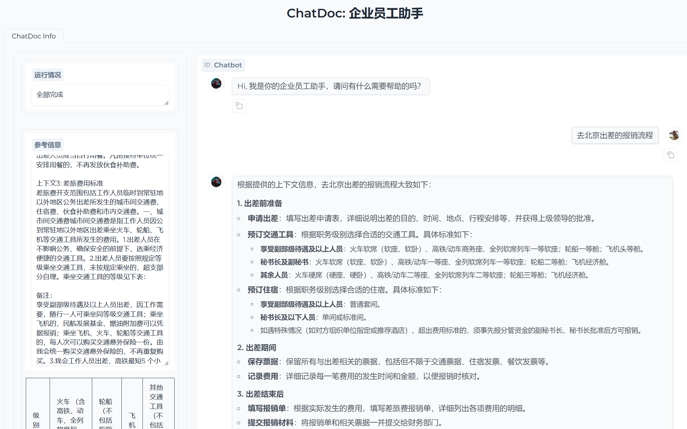
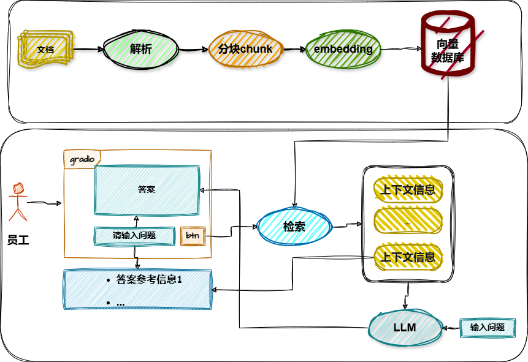

# RAG项目——ChatDoc展示

## 1. 项目说明

这个是基于gradio实现的企业员工助手ChatDoc的前台文本展示，效果图如下：




**整体项目结构为：**



## 2. 执行

- 环境安装参见项目：


- 技术选型
        
    Python 3.10  

    RAGFlow deepdoc (用于构建和部署基于检索增强生成)

    向量数据库: Chorma
    
    Embedding Model: bge-m3 4.27GB

    modelscope: https://modelscope.cn/models
    

- 项目启动

``` shell

uvicorn chatdoc:app --host 127.0.0.1 --port 7680 --workers 4


# 在浏览器中输入 http://127.0.0.1:7680/erag
```